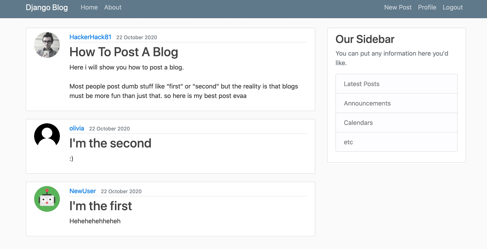

# Django-Blog

## <a href="https://olivia-helmuth-django-blog.herokuapp.com/" target="_blank">Live Demo</a>

a simple Blog with following functionalities:
* register, login, logout to an account
* create, read, update, delete posts
* update profile infos and upload profile picture
* reset password




## technologies used 
* Django
* Postgresql
* Bootstrap
* Crispy Forms

## Setup
``` shell
$ git clone https://github.com/OliviaHelmuth/Django-Blog.git
$ cd Django-Blog
$ pip install
```